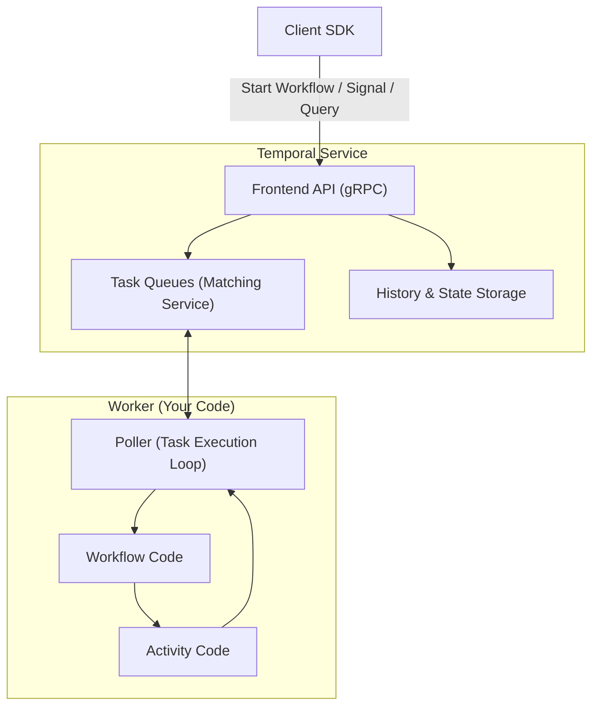

One of my recent favourite technologies is Temporal. It's 


> durable execution platform—a modern toolkit for building resilient, long-running workflows in a code-centric, scalable way.


Basically, it helps engineers build a reliable workflow by providing ways to retry, resume, and replay the execution at the desired point in time.

Below is the highlevel overview of Temporal's components. This post will focus on the `Workflow code` that is engineer's responsibility to control.




## Workflow Determinism

This is the most important part when you want to get a long with Temporal.

> A critical aspect of developing Workflow Definitions is ensuring they exhibit certain deterministic traits – that is, making sure that the same Commands are emitted in the same sequence

- https://docs.temporal.io/workflows#deterministic-constraints
- https://docs.temporal.io/workflows#workflow-versioning
- https://docs.temporal.io/develop/go/versioning

In general, Temporal rely on execution history to recover state, so a workflow must always produce the same sequence of commands and results for the same inputs, ensuring consistent and predictable outcomes even after failures or restarts. 

Below are things that I think most of dev will need to know to maintain the workflow determinism across its **life time** is to ensure our application doesn’t break after code changing, or runtime pod restart. 


### Don't change the activity

```go
// old code
function Workflow(ctx workflow.Context, inout interface{}) (err error){
   ...
   workflow.ExecuteActivity(activity_A)
   ....
}

// new code
function Workflow(ctx workflow.Context, inout interface{}) (err error){
   ...
   workflow.ExecuteActivity(activity_B)
   ....
}

--> non determisitic error
```

### Be cautious with branching condition

```go
function Workflow(ctx workflow.Context, inout interface{}) (err error){
   ...
   if time.Now() < '10/10/2024' {
	   workflow.ExecuteActivity(activity_A)
   }
   ....
}

--> non determisitic error if the workflow is replayed after 10/10/2024
```

### Use versioning to patch workflow

```go
// old code
function Workflow(ctx workflow.Context, inout interface{}) (err error){
   ...
   workflow.ExecuteActivity(activity_A)
   ....
}

// new patching code
function Workflow(ctx workflow.Context, inout interface{}) (err error){
   ...
   v := workflow.GetVersion(ctx,
		"deperated-actitivy-A",
		workflow.DefaultVersion, 1,
	)
	
	 if v == workflow.DefaultVersion{
	    workflow.ExecuteActivity(activity_A)
	 } else {
	   workflow.ExecuteActivity(activity_B)
	 }
   ....
}

--> when replaying, existing workflows have default version of 
"deperated-actitivy-A", so they will see the correct path.
New workflows will have version 1 then executes activity B
```

### CI-CD

To ensure the determinism in real world scenario, the best practice is having CI-CD pipeline that replays the recent running workflows against new workflow definition. It will caught non-deterministic error.

```go
import (
    "go.temporal.io/sdk/worker"
    "log/slog"
)

// replay the workflow histories of current running workflow instance
func DeterminismCheck(workflow any){
    histories, err := GetLatestRunningWorkflowsHistory(waitCtx, wfType, 100)
    if err != nil {
        panic(err)
    }
    replayer := worker.NewWorkflowReplayer()
    replayer.RegisterWorkflow(workflow)

    errs := make([]error, 0)
    for _, hist := range histories {
        if err = replayer.ReplayWorkflowHistory(slog.Default(), hist); err != nil {
            errs = append(errs, err)
        }
    }

    if len(errs) != 0 {
        panic(errs)
    }
}


// query: condition to find workflow executions
func GetLatestRunningWorkflowsHistory(ctx context.Context, query string, size int32) (histories []*history.History, err error) {
    if size == 0 {
		size = 10
	}

    tprClient := GetTemporalClient()
    resp, err := tprClient.ListWorkflow(ctx, &workflowservice.ListWorkflowExecutionsRequest{
        Query:    query,
        PageSize: size,
    })
    if err != nil {
        return
    }

    for _, exe := range resp.GetExecutions() {
        wfExe := exe.GetExecution()
        hist, err := GetWorkflowHistory(ctx, tprClient, wfExe.WorkflowId, wfExe.RunId)
        if err != nil {
            return nil, fmt.Errorf("get event history error: %w", err)
        }
        histories = append(histories, hist)
    }

    return
}

// Get execution history 
func GetWorkflowHistory(ctx context.Context, client client.Client, id, runID string) (*history.History, error) {
	if client == nil {
		client = GetTemporalClient()
	}
	var hist history.History
	iter := client.GetWorkflowHistory(ctx, id, runID, false, enums.HISTORY_EVENT_FILTER_TYPE_ALL_EVENT)
	for iter.HasNext() {
		event, err := iter.Next()
		if err != nil {
			err = errors.Wrap(err, "failed to get next event")
			return nil, err
		}
		hist.Events = append(hist.Events, event)
	}
	return &hist, nil
}
```