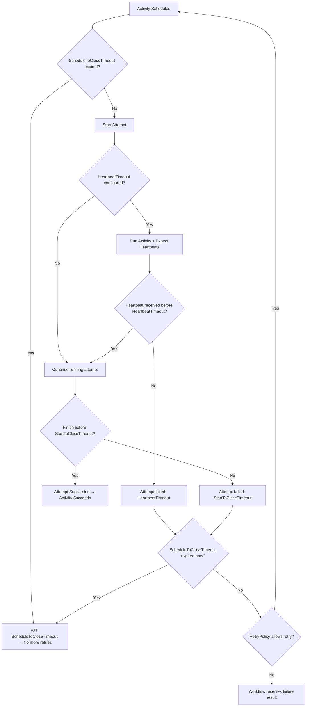

To continue the series about Temporal, in this blog post, I will talk about the activity options in detail.
Understanding the meaning of the important fields will help to control the behavior of the activity execution, retries and resilient to service/pod restarts. The Temporal has really insightful and detail document and code comments about these fields, but here's the recap:

* **StartToCloseTimeout**: The maximum amount of time an activity is allowed to run in a single attempt. If the activity exceeds this duration, it times out and is considered failed for that attempt. Temporal will then either retry it based on the **RetryPolicy** or mark the activity as failed if no retries remain.
* **ScheduleToCloseTimeout**: The maximum amount of time from when an activity is scheduled until it completes, including all retries. You must specify either this value or **StartToCloseTimeout** when starting an activity.
* **RetryPolicy**: Controls the retry behavior, including exponential backoff settings. There is a `NonRetryableErrorTypes` field that you should pay attention to.
* **HeartbeatTimeout**: The required interval for an activity to call **RecordHeartbeat** to communicate liveness to the Temporal Service. If the activity fails to send a heartbeat within this interval, it is treated as failed and the Temporal Service will retry it according to the **RetryPolicy**.



### Timeout

* Set a meaningful **StartToCloseTimeout** based on how long the activity should normally take to finish. Avoid setting it too large without a **HeartbeatTimeout**, because the workflow can become stuck for a long time if the worker restarts and the activity does not report progress.
* Set a **ScheduleToCloseTimeout** when using heartbeat-enabled activities to ensure retries stay within a reasonable overall time window.

In Golang, the pattern when using heartbeat looks like

```go
func ActivityA(ctx context.Context, input any) error{
  ...

  activityHeartbeatTimeout := activity.GetInfo(ctx).HeartbeatTimeout

  heartbeatCtx, cancel := context.WithCancel(ctx)
  defer cancel()

  // should send the heartbeat more frequently than the setting value, it accounts to some issues like network delay, GC pauses...
  heartbeatInterval := time.Duration(float64(activity.GetInfo(ctx)).HeartbeatTimeout * 0.8)
  go sendHeartbeat(heartbeatCtx, heartbeatInterval, "hearbeat from A")

  ...
}

func sendHeartbeat(ctx context.Contet, heartbeatInterval time.Duration, message string){
  ticker := time.NewTicker(heartbeatInterval)
  defer ticker.Stop()

  for {
    select {
      case <-ctx.Done():
        return
      case <-ticker.C:
        activity.RecordHeartbeat(ctx, message)
    }
  }
}
```

### NonRetryableErrorTypes

This is a slice of strings containing error *types* that should not be retried. If your Activity returns an error whose type matches one in this list, Temporal will immediately fail the Activity without attempting any retries.

The practice is setting this field for handling deterministic errors (e.g., "invalid input" or "unauthorized api") where a retry would never succeed. 

Also, the notable point is Tempoal doesn't unwrap the error to check if a returned error *contains* a type listed in `NonRetryableErrorTypes`, e.g:

```go
func ActivityA(ctx context.Context, input any) error{
  ...

  // In your Activity
  return fmt.Errorf("database lookup failed: %w", sql.ErrNoRows)
}

// In your Workflow
ao := workflow.ActivityOptions{
    StartToCloseTimeout: 10 * time.Minute,
    RetryPolicy:         RetryPolicy: &temporal.RetryPolicy{
    NonRetryableErrorTypes: []string{
            "ErrNoRows"
        }, // This WILL NOT work
    },
}
ctx = workflow.WithActivityOptions(ctx, ao)
workflow.ExecuteActivity(ctx, ActivityA, "...")
```

The developer can use sdk provided functions:

* `temporal.NewNonRetryableApplicationError`: This is an explicit method that will stop retrying regardless of the policy
* `temporal.NewApplicationError("message", "ERR_TYPE", err):` Use it to define Temporal error, and set a custom Type string. That makes it easy to set `NonRetryableErrorTypes`

```go
func ActivityA(ctx context.Context, input any) error{
  ...

  if errors.Is(err, sql.ErrNoRows) {
        // Return an ApplicationError with a custom "Type" string
        return temporal.NewApplicationError(
            "User not found", // Message
            "SQL_NOT_FOUND", // The custom Type string
            err,
        )
    }
}

// In your Workflow
ao := workflow.ActivityOptions{
    StartToCloseTimeout: 10 * time.Minute,
    RetryPolicy:         RetryPolicy: &temporal.RetryPolicy{
    NonRetryableErrorTypes: []string{
            "SQL_NOT_FOUND"
        }, // This WILL work
    },
}
ctx = workflow.WithActivityOptions(ctx, ao)
workflow.ExecuteActivity(ctx, ActivityA,
"...")

```
